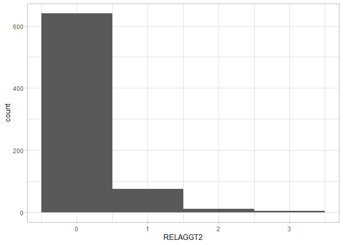
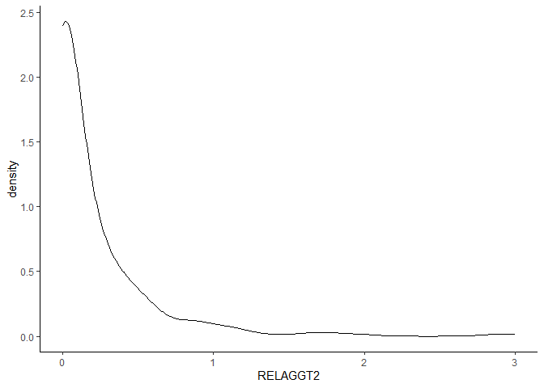
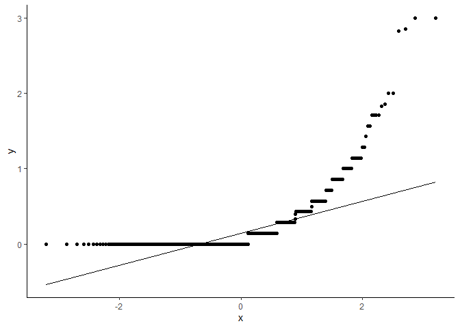
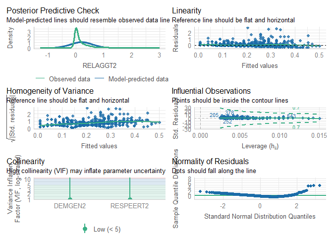
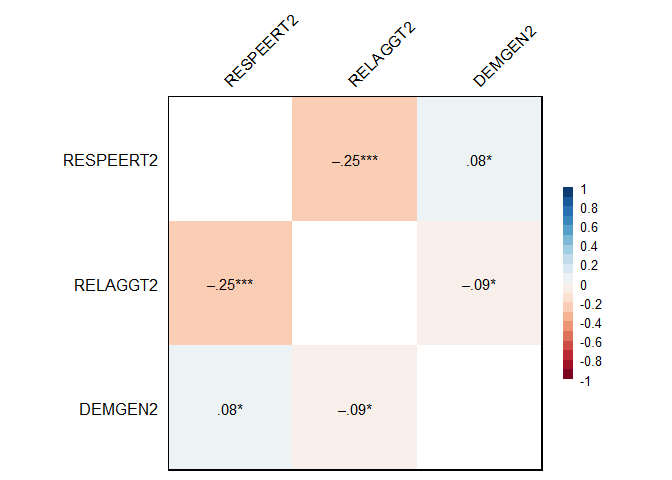
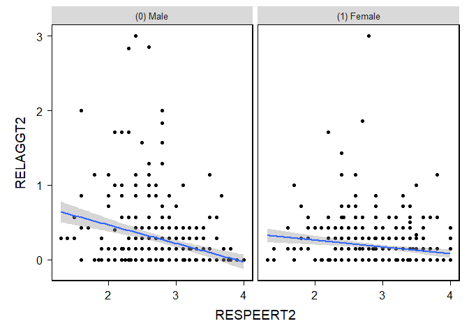
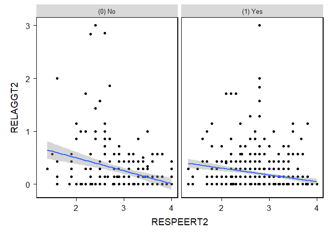
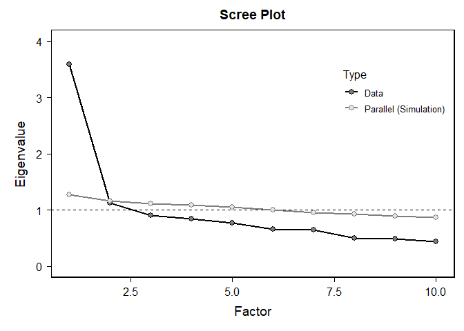

my project and dataset
================
Jack Sutton
2024-10-10

# Is the relationship between peer influence and relational aggression different between young men and women?

\#troubleshooting chunk

``` r
options(repos = c(CRAN = "https://cran.rstudio.com"))
```

# load packages

``` r
library(haven)
library(dplyr)
```

    ## 
    ## Attaching package: 'dplyr'

    ## The following objects are masked from 'package:stats':
    ## 
    ##     filter, lag

    ## The following objects are masked from 'package:base':
    ## 
    ##     intersect, setdiff, setequal, union

``` r
library(ggplot2)
library(tidyr)
library(psych)
```

    ## 
    ## Attaching package: 'psych'

    ## The following objects are masked from 'package:ggplot2':
    ## 
    ##     %+%, alpha

``` r
library(bruceR)
```

    ## 
    ## bruceR (v2024.6)
    ## Broadly Useful Convenient and Efficient R functions
    ## 
    ## Packages also loaded:
    ## ✔ data.table ✔ emmeans
    ## ✔ dplyr      ✔ lmerTest
    ## ✔ tidyr      ✔ effectsize
    ## ✔ stringr    ✔ performance
    ## ✔ ggplot2    ✔ interactions
    ## 
    ## Main functions of `bruceR`:
    ## cc()             Describe()  TTEST()
    ## add()            Freq()      MANOVA()
    ## .mean()          Corr()      EMMEANS()
    ## set.wd()         Alpha()     PROCESS()
    ## import()         EFA()       model_summary()
    ## print_table()    CFA()       lavaan_summary()
    ## 
    ## For full functionality, please install all dependencies:
    ## install.packages("bruceR", dep=TRUE)
    ## 
    ## Online documentation:
    ## https://psychbruce.github.io/bruceR
    ## 
    ## To use this package in publications, please cite:
    ## Bao, H.-W.-S. (2024). bruceR: Broadly useful convenient and efficient R functions (Version 2024.6) [Computer software]. https://CRAN.R-project.org/package=bruceR

    ## 
    ## These packages are dependencies of `bruceR` but not installed:
    ## - pacman, openxlsx, ggtext, lmtest, vars, phia, MuMIn, GGally
    ## 
    ## ***** Install all dependencies *****
    ## install.packages("bruceR", dep=TRUE)

``` r
library(ggstatsplot)
```

    ## You can cite this package as:
    ##      Patil, I. (2021). Visualizations with statistical details: The 'ggstatsplot' approach.
    ##      Journal of Open Source Software, 6(61), 3167, doi:10.21105/joss.03167

``` r
library(performance)
library(sjPlot)
```

\<\<\<\<\<\<\< HEAD \# load

``` r
load("C:/Users/ajsut/Documents/GitHub/myproject/36850-0003-Data.rda")
```

# ignore other variables

``` r
new_dataset <- da36850.0003 %>%
  select(RESPEERT2, RELAGGT2, DEMGEN2)
```

# RESPEERT2 is a premade composite of Revised Peer Influence Scale Items with reverse codings corrected. 1 represents low peer resistance, 4 represents high peer resistance.

# RELAGGT2 is a premade composite of Relational Aggression, 1 Represents low tendency towards relational aggression, 4 represents high tendency towards relational aggression.

# DEMGEN2 is a grouping variable by gender demographic.

``` r
summary(new_dataset)
```

    ##    RESPEERT2        RELAGGT2            DEMGEN2   
    ##  Min.   :1.300   Min.   :0.0000   (0) Male  :332  
    ##  1st Qu.:2.600   1st Qu.:0.0000   (1) Female:401  
    ##  Median :3.000   Median :0.0000   NA's      :  1  
    ##  Mean   :2.975   Mean   :0.1992                   
    ##  3rd Qu.:3.400   3rd Qu.:0.2857                   
    ##  Max.   :4.000   Max.   :3.0000                   
    ##  NA's   :4

\#summary indicates NA values for some variables.

``` r
list_new_dataset <- drop_na(new_dataset)
```

\#NA are dropped listwise to clean data. Participants with NA entries on
any variable are omitted from the dataset.

``` r
summary(list_new_dataset)
```

    ##    RESPEERT2        RELAGGT2            DEMGEN2   
    ##  Min.   :1.300   Min.   :0.0000   (0) Male  :331  
    ##  1st Qu.:2.600   1st Qu.:0.0000   (1) Female:398  
    ##  Median :3.000   Median :0.0000                   
    ##  Mean   :2.974   Mean   :0.2003                   
    ##  3rd Qu.:3.400   3rd Qu.:0.2857                   
    ##  Max.   :4.000   Max.   :3.0000

\#Summary indicates no more missing values in new dataset
(list_new_dataset)

\#normality check of the variables, Shapiro-Wilk and GGPlot

``` r
describe(list_new_dataset$RELAGGT2)
```

    ##    vars   n mean   sd median trimmed mad min max range skew kurtosis   se
    ## X1    1 729  0.2 0.38      0    0.11   0   0   3     3 3.58    17.53 0.01

``` r
shapiro.test(list_new_dataset$RELAGGT2)
```

    ## 
    ##  Shapiro-Wilk normality test
    ## 
    ## data:  list_new_dataset$RELAGGT2
    ## W = 0.57438, p-value < 2.2e-16

``` r
ggplot(list_new_dataset, aes(x = RELAGGT2)) + geom_histogram(binwidth = 1)+ theme_light()
```

<!-- -->

``` r
ggplot(list_new_dataset, aes(x = RELAGGT2)) + geom_density(adjust = 2)  + theme_classic()
```

<!-- -->

``` r
qq<-ggplot(list_new_dataset, aes(sample = RELAGGT2)) + geom_qq()  + theme_classic()

qq+ geom_qq_line()
```

<!-- --> Result of
Shapiro-Wilk test indicates a low W-Value of 0.57438 and a p-value of
p-value \< 2.2e-16. This means that the distribution is very
significantly non-normal. GGplot also indicates a positive skew, it is
visually non-normal.

\#Use the describeBy() function to get skewness and kurtosis by group

``` r
describeBy(RELAGGT2 ~ DEMGEN2, data = list_new_dataset)
```

    ## 
    ##  Descriptive statistics by group 
    ## DEMGEN2: (0) Male
    ##          vars   n mean   sd median trimmed mad min max range skew kurtosis   se
    ## RELAGGT2    1 331 0.24 0.45      0    0.13   0   0   3     3 3.12    11.96 0.02
    ## ------------------------------------------------------------ 
    ## DEMGEN2: (1) Female
    ##          vars   n mean  sd median trimmed mad min max range skew kurtosis   se
    ## RELAGGT2    1 398 0.17 0.3      0    0.11   0   0   3     3 3.85    24.44 0.01

``` r
list_new_dataset %>%
  group_by(DEMGEN2) %>%
  summarize(W = shapiro.test(RELAGGT2)$statistic, p_value = shapiro.test(RELAGGT2)$p.value)
```

    ## # A tibble: 2 × 3
    ##   DEMGEN2        W  p_value
    ##   <fct>      <dbl>    <dbl>
    ## 1 (0) Male   0.583 2.00e-27
    ## 2 (1) Female 0.598 2.35e-29

\#For both males and females, the results of skew tests indicate a
positive right skew above +1. Kurtosis tests indicated that the extent
of the skew for each group will result in a high frequency of extreme
values.

\#equal variance check for DV not necessasry since my question is an
outcome, not a simple difference. \#correlation testing does not require
normality so I can move on to testing… but first some assumption checks

\#LAB 8 STARTS HERE

``` r
model<-lm(RELAGGT2 ~ RESPEERT2 + DEMGEN2, data = list_new_dataset)

check_model(model)
```

<!-- -->

\#assumption of colinearity is met (\<5)

\#all of the below tests are correlations. I ran a correlation to see
the relation between my IV and DV, then I ran the same tests for gender,
and race (white, nonwhite) to see whether the correlation differs in
those groups.

\#first check is if RELAGGT2 is related to RESPEERT2 without any
grouping variable…

``` r
Corr(list_new_dataset)
```

    ## NOTE: `DEMGEN2` transformed to numeric.
    ## 
    ## Pearson's r and 95% confidence intervals:
    ## ──────────────────────────────────────────────────────
    ##                         r       [95% CI]     p       N
    ## ──────────────────────────────────────────────────────
    ## RESPEERT2-RELAGGT2  -0.25 [-0.32, -0.18] <.001 *** 729
    ## RESPEERT2-DEMGEN2    0.08 [ 0.01,  0.15]  .026 *   729
    ## RELAGGT2-DEMGEN2    -0.09 [-0.16, -0.02]  .013 *   729
    ## ──────────────────────────────────────────────────────

<!-- -->

    ## Correlation matrix is displayed in the RStudio `Plots` Pane.

\#Initial correlation shows resistance to peer influence is
significantly inversely correlated with relational aggression. As
resistance to peer influence increases, relational aggression decreases
and as resistance to peer influence decreases, relational aggression
increases (r= -.25).

\#now, to test this correlation on the grouping variable of gender…

``` r
PROCESS(list_new_dataset, y = "RELAGGT2", x = "RESPEERT2", mods = c("DEMGEN2"))
```

    ## 
    ## ****************** PART 1. Regression Model Summary ******************
    ## 
    ## PROCESS Model Code : 1 (Hayes, 2018; www.guilford.com/p/hayes3)
    ## PROCESS Model Type : Simple Moderation
    ## -    Outcome (Y) : RELAGGT2
    ## -  Predictor (X) : RESPEERT2
    ## -  Mediators (M) : -
    ## - Moderators (W) : DEMGEN2
    ## - Covariates (C) : -
    ## -   HLM Clusters : -
    ## 
    ## All numeric predictors have been grand-mean centered.
    ## (For details, please see the help page of PROCESS.)
    ## 
    ## Formula of Outcome:
    ## -    RELAGGT2 ~ RESPEERT2*DEMGEN2
    ## 
    ## CAUTION:
    ##   Fixed effect (coef.) of a predictor involved in an interaction
    ##   denotes its "simple effect/slope" at the other predictor = 0.
    ##   Only when all predictors in an interaction are mean-centered
    ##   can the fixed effect denote the "main effect"!
    ##   
    ## Model Summary
    ## 
    ## ───────────────────────────────────────────────────────
    ##                              (1) RELAGGT2  (2) RELAGGT2
    ## ───────────────────────────────────────────────────────
    ## (Intercept)                    0.200 ***     0.226 *** 
    ##                               (0.014)       (0.020)    
    ## RESPEERT2                     -0.167 ***    -0.249 *** 
    ##                               (0.024)       (0.035)    
    ## DEMGEN2(1) Female                           -0.053 *   
    ##                                             (0.027)    
    ## RESPEERT2:DEMGEN2(1) Female                  0.158 *** 
    ##                                             (0.047)    
    ## ───────────────────────────────────────────────────────
    ## R^2                            0.063         0.082     
    ## Adj. R^2                       0.062         0.079     
    ## Num. obs.                    729           729         
    ## ───────────────────────────────────────────────────────
    ## Note. * p < .05, ** p < .01, *** p < .001.
    ## 
    ## ************ PART 2. Mediation/Moderation Effect Estimate ************
    ## 
    ## Package Use : ‘interactions’ (v1.2.0)
    ## Effect Type : Simple Moderation (Model 1)
    ## Sample Size : 729
    ## Random Seed : -
    ## Simulations : -
    ## 
    ## Interaction Effect on "RELAGGT2" (Y)
    ## ────────────────────────────────────────────
    ##                          F df1 df2     p    
    ## ────────────────────────────────────────────
    ## RESPEERT2 * DEMGEN2  11.12   1 725 <.001 ***
    ## ────────────────────────────────────────────
    ## 
    ## Simple Slopes: "RESPEERT2" (X) ==> "RELAGGT2" (Y)
    ## ────────────────────────────────────────────────────────────
    ##  "DEMGEN2"  Effect    S.E.      t     p             [95% CI]
    ## ────────────────────────────────────────────────────────────
    ##  (0) Male   -0.249 (0.035) -7.105 <.001 *** [-0.318, -0.180]
    ##  (1) Female -0.091 (0.032) -2.827  .005 **  [-0.154, -0.028]
    ## ────────────────────────────────────────────────────────────

\#These results indicate that there is a significant difference for the
peer influence and relational aggression relationship between men and
women. For men, this relationship is significantly inversely related
(r=-.249). For women, it is inversely related as well, but not to a
significant extent (r=-.091). \#let’s visualize…

``` r
ggplot(list_new_dataset, aes(x = RESPEERT2, y = RELAGGT2)) + geom_point() + geom_smooth(method=lm) + facet_wrap(~DEMGEN2) + theme_bruce()
```

    ## `geom_smooth()` using formula = 'y ~ x'

<!-- --> Research
Question, First Analysis Interpretation \#My research question is
whether men and women differ significantly in the extent to which peer
influence relates to relational aggression behaviors. From this
correlation, we can interpret that men are less resistant to peer
influence may relate to more relational aggression compared to women. We
can see the same pattern in the plots. The line is clearly steeper for
men.

# now I’ll try this with a different grouping variable…

``` r
#get the excluded variables back and select new ones...
new_dataset_white <- da36850.0003 %>%
  select(RESPEERT2, RELAGGT2, DEMRA2010)
#exclude NA
list_new_dataset_white <- drop_na(new_dataset_white)
#check correlation
PROCESS(list_new_dataset_white, y = "RELAGGT2", x = "RESPEERT2", mods = c("DEMRA2010"))
```

    ## 
    ## ****************** PART 1. Regression Model Summary ******************
    ## 
    ## PROCESS Model Code : 1 (Hayes, 2018; www.guilford.com/p/hayes3)
    ## PROCESS Model Type : Simple Moderation
    ## -    Outcome (Y) : RELAGGT2
    ## -  Predictor (X) : RESPEERT2
    ## -  Mediators (M) : -
    ## - Moderators (W) : DEMRA2010
    ## - Covariates (C) : -
    ## -   HLM Clusters : -
    ## 
    ## All numeric predictors have been grand-mean centered.
    ## (For details, please see the help page of PROCESS.)
    ## 
    ## Formula of Outcome:
    ## -    RELAGGT2 ~ RESPEERT2*DEMRA2010
    ## 
    ## CAUTION:
    ##   Fixed effect (coef.) of a predictor involved in an interaction
    ##   denotes its "simple effect/slope" at the other predictor = 0.
    ##   Only when all predictors in an interaction are mean-centered
    ##   can the fixed effect denote the "main effect"!
    ##   
    ## Model Summary
    ## 
    ## ──────────────────────────────────────────────────────
    ##                             (1) RELAGGT2  (2) RELAGGT2
    ## ──────────────────────────────────────────────────────
    ## (Intercept)                   0.200 ***     0.258 *** 
    ##                              (0.014)       (0.024)    
    ## RESPEERT2                    -0.167 ***    -0.245 *** 
    ##                              (0.024)       (0.040)    
    ## DEMRA2010(1) Yes                           -0.082 **  
    ##                                            (0.029)    
    ## RESPEERT2:DEMRA2010(1) Yes                  0.116 *   
    ##                                            (0.049)    
    ## ──────────────────────────────────────────────────────
    ## R^2                           0.064         0.080     
    ## Adj. R^2                      0.062         0.076     
    ## Num. obs.                   730           730         
    ## ──────────────────────────────────────────────────────
    ## Note. * p < .05, ** p < .01, *** p < .001.
    ## 
    ## ************ PART 2. Mediation/Moderation Effect Estimate ************
    ## 
    ## Package Use : ‘interactions’ (v1.2.0)
    ## Effect Type : Simple Moderation (Model 1)
    ## Sample Size : 730
    ## Random Seed : -
    ## Simulations : -
    ## 
    ## Interaction Effect on "RELAGGT2" (Y)
    ## ─────────────────────────────────────────────
    ##                           F df1 df2     p    
    ## ─────────────────────────────────────────────
    ## RESPEERT2 * DEMRA2010  5.53   1 726  .019 *  
    ## ─────────────────────────────────────────────
    ## 
    ## Simple Slopes: "RESPEERT2" (X) ==> "RELAGGT2" (Y)
    ## ─────────────────────────────────────────────────────────────
    ##  "DEMRA2010" Effect    S.E.      t     p             [95% CI]
    ## ─────────────────────────────────────────────────────────────
    ##  (0) No      -0.245 (0.040) -6.141 <.001 *** [-0.323, -0.167]
    ##  (1) Yes     -0.129 (0.029) -4.395 <.001 *** [-0.186, -0.071]
    ## ─────────────────────────────────────────────────────────────

``` r
ggplot(list_new_dataset_white, aes(x = RESPEERT2, y = RELAGGT2)) + geom_point() + geom_smooth(method=lm) + facet_wrap(~DEMRA2010) + theme_bruce()
```

    ## `geom_smooth()` using formula = 'y ~ x'

<!-- --> Second
Analysis Interpretation \# Comparing the same relationship in terms of
being white or non-white… both groups show this significacnt
relationship. Both are significant, however those who are not white show
a slightly greater inverse relationship than those who are white. This
could be interpreted as non-white people may be more influenced by peers
in turn relating to greater relational aggression. Again, in the plots,
the line is visually steeper for non-white participants than white
participants. Meaning the relationship was stronger in that group.

LAB10 STARTS HERE –\> RELIABILITY CHECKS OF MY OWN DATA AND FACTOR
ANALYSES, \#first, I need to get the original items for my composites,
since the composites were premade in the dataset. This is why I clean
the greater dataset here:

``` r
new_dataset_allitems <- da36850.0003 %>%
  select(REPEIN201, REPEIN202, REPEIN203, REPEIN204, REPEIN205, REPEIN206, REPEIN207, REPEIN208, REPEIN209, REPEIN210, PBFS202, PBFS205, PBFS207, PBFS217, PBFS221, PBFS224, PBFS225)
```

\#and to drop any N/A values…

``` r
list_new_dataset_allitems <- drop_na(new_dataset_allitems)
```

\#list_new_dataset is the set with just the composites. \#now we work
with all the individual items under list_new_dataset_allitems

\#B1 Relational Aggression is the construct for the RELAGGT2 variable.
Its composite is measured across 7 items.

``` r
#Test reliability of scale variables.
#Reliability of RELAGGT2 (Relational Aggression)
Alpha(list_new_dataset_allitems, vars=c("PBFS202", "PBFS205", "PBFS207", "PBFS217", "PBFS221", "PBFS224", 
"PBFS225"))
```

    ## 
    ## Reliability Analysis
    ## 
    ## Summary:
    ## Total Items: 7
    ## Scale Range: 1 ~ 6
    ## Total Cases: 685
    ## Valid Cases: 685 (100.0%)
    ## 
    ## Scale Statistics:
    ## Mean = 1.200
    ## S.D. = 0.367
    ## Cronbach’s α = 0.766
    ## McDonald’s ω = 0.819
    ## 
    ## Item Statistics (Cronbach’s α If Item Deleted):
    ## ──────────────────────────────────────────────────
    ##           Mean    S.D. Item-Rest Cor. Cronbach’s α
    ## ──────────────────────────────────────────────────
    ## PBFS202  1.309 (0.671)          0.494        0.737
    ## PBFS205  1.130 (0.442)          0.599        0.721
    ## PBFS207  1.061 (0.309)          0.541        0.743
    ## PBFS217  1.109 (0.410)          0.540        0.733
    ## PBFS221  1.114 (0.526)          0.529        0.729
    ## PBFS224  1.171 (0.454)          0.623        0.716
    ## PBFS225  1.505 (0.939)          0.440        0.789
    ## ──────────────────────────────────────────────────
    ## Item-Rest Cor. = Corrected Item-Total Correlation

\#C1 \#For relational aggression, a cronbach’s alpha of .766
demonstrates good reliability. There is high internal consistency
between items in this scale.

\#B2 Resistance to Peer Influence is the construct for the RESPEERT2
variable. Its composite is measured across 10 items.

``` r
#Reliability of RESPEERT2 (Resistance to Peer Influence)
Alpha(list_new_dataset_allitems, vars=c("REPEIN201", "REPEIN202", "REPEIN203", "REPEIN204", "REPEIN205", "REPEIN206", "REPEIN207", "REPEIN208", "REPEIN209", "REPEIN210"))
```

    ## 
    ## Reliability Analysis
    ## 
    ## Summary:
    ## Total Items: 10
    ## Scale Range: 1 ~ 4
    ## Total Cases: 685
    ## Valid Cases: 685 (100.0%)
    ## 
    ## Scale Statistics:
    ## Mean = 2.979
    ## S.D. = 0.572
    ## Cronbach’s α = 0.794
    ## McDonald’s ω = 0.799
    ## 
    ## Item Statistics (Cronbach’s α If Item Deleted):
    ## ────────────────────────────────────────────────────
    ##             Mean    S.D. Item-Rest Cor. Cronbach’s α
    ## ────────────────────────────────────────────────────
    ## REPEIN201  2.496 (0.967)          0.419        0.782
    ## REPEIN202  3.101 (0.964)          0.480        0.775
    ## REPEIN203  2.870 (0.942)          0.399        0.784
    ## REPEIN204  3.222 (0.897)          0.590        0.763
    ## REPEIN205  2.842 (1.081)          0.540        0.767
    ## REPEIN206  3.480 (0.866)          0.389        0.785
    ## REPEIN207  3.171 (0.959)          0.460        0.777
    ## REPEIN208  2.371 (1.046)          0.302        0.797
    ## REPEIN209  3.143 (0.958)          0.592        0.761
    ## REPEIN210  3.092 (0.956)          0.513        0.771
    ## ────────────────────────────────────────────────────
    ## Item-Rest Cor. = Corrected Item-Total Correlation

\#C2 \#For resistance to peer influence, a cronbach’s alpha of .794
demonstrates good reliability. There is high internal consistency
between items in this scale.

\#D1 \#Factor anaysis of Relational Aggression (RELAGGT2)

``` r
EFA(list_new_dataset_allitems, vars=c("PBFS202", "PBFS205", "PBFS207", "PBFS217", "PBFS221", "PBFS224", "PBFS225"), method = "pa", plot.scree = TRUE, nfactors = c("parallel"))
```

    ## 
    ## Explanatory Factor Analysis
    ## 
    ## Summary:
    ## Total Items: 7
    ## Scale Range: 1 ~ 6
    ## Total Cases: 685
    ## Valid Cases: 685 (100.0%)
    ## 
    ## Extraction Method:
    ## - Principal Axis Factor Analysis
    ## Rotation Method:
    ## - (Only one component was extracted. The solution was not rotated.)
    ## 
    ## KMO and Bartlett's Test:
    ## - Kaiser-Meyer-Olkin (KMO) Measure of Sampling Adequacy: MSA = 0.846
    ## - Bartlett's Test of Sphericity: Approx. χ²(21) = 1389.66, p < 1e-99 ***
    ## 
    ## Total Variance Explained:
    ## ───────────────────────────────────────────────────────────────────────────────
    ##           Eigenvalue Variance % Cumulative % SS Loading Variance % Cumulative %
    ## ───────────────────────────────────────────────────────────────────────────────
    ## Factor 1       3.360     48.004       48.004      2.774     39.630       39.630
    ## Factor 2       0.924     13.199       61.203                                   
    ## Factor 3       0.751     10.723       71.926                                   
    ## Factor 4       0.600      8.567       80.494                                   
    ## Factor 5       0.516      7.369       87.863                                   
    ## Factor 6       0.442      6.315       94.178                                   
    ## Factor 7       0.408      5.822      100.000                                   
    ## ───────────────────────────────────────────────────────────────────────────────
    ## 
    ## Factor Loadings (Sorted by Size):
    ## ──────────────────────────
    ##            PA1 Communality
    ## ──────────────────────────
    ## PBFS205  0.717       0.513
    ## PBFS224  0.673       0.452
    ## PBFS207  0.667       0.445
    ## PBFS217  0.650       0.423
    ## PBFS221  0.633       0.400
    ## PBFS202  0.560       0.313
    ## PBFS225  0.477       0.228
    ## ──────────────────────────
    ## Communality = Sum of Squared (SS) Factor Loadings
    ## (Uniqueness = 1 - Communality)

<!-- --> \#Factor
analysis of Relational Aggression reveals just one factor (PBFS205)
because its eigenvalue is above 1, its point is on the slope not the the
scree/flat, and it is above the parallel. With the highest loading of
.717, about 71% of variance in the Relational Aggression varaible may be
explained by this item. The range of all loadings is between .717 and
.477.

\#E1 \#Overall, this range and its high end suggests this variable has
good measurement validity. All items are above .4 and most are close to
1.

\#D2 \#Factor anaysis of Resistance to Peer Influence (RESPEERT2)

``` r
EFA(list_new_dataset_allitems, vars=c("REPEIN201", "REPEIN202", "REPEIN203", "REPEIN204", "REPEIN205", "REPEIN206", "REPEIN207", "REPEIN208", "REPEIN209", "REPEIN210"), method = "pa", plot.scree = TRUE, nfactors = c("parallel"))
```

    ## 
    ## Explanatory Factor Analysis
    ## 
    ## Summary:
    ## Total Items: 10
    ## Scale Range: 1 ~ 4
    ## Total Cases: 685
    ## Valid Cases: 685 (100.0%)
    ## 
    ## Extraction Method:
    ## - Principal Axis Factor Analysis
    ## Rotation Method:
    ## - (Only one component was extracted. The solution was not rotated.)
    ## 
    ## KMO and Bartlett's Test:
    ## - Kaiser-Meyer-Olkin (KMO) Measure of Sampling Adequacy: MSA = 0.852
    ## - Bartlett's Test of Sphericity: Approx. χ²(45) = 1485.44, p < 1e-99 ***
    ## 
    ## Total Variance Explained:
    ## ────────────────────────────────────────────────────────────────────────────────
    ##            Eigenvalue Variance % Cumulative % SS Loading Variance % Cumulative %
    ## ────────────────────────────────────────────────────────────────────────────────
    ## Factor 1        3.596     35.957       35.957      2.924     29.241       29.241
    ## Factor 2        1.130     11.303       47.260                                   
    ## Factor 3        0.913      9.126       56.386                                   
    ## Factor 4        0.843      8.428       64.815                                   
    ## Factor 5        0.774      7.745       72.560                                   
    ## Factor 6        0.664      6.641       79.200                                   
    ## Factor 7        0.651      6.513       85.714                                   
    ## Factor 8        0.505      5.052       90.766                                   
    ## Factor 9        0.486      4.861       95.627                                   
    ## Factor 10       0.437      4.373      100.000                                   
    ## ────────────────────────────────────────────────────────────────────────────────
    ## 
    ## Factor Loadings (Sorted by Size):
    ## ────────────────────────────
    ##              PA1 Communality
    ## ────────────────────────────
    ## REPEIN209  0.677       0.458
    ## REPEIN204  0.669       0.447
    ## REPEIN205  0.614       0.377
    ## REPEIN210  0.587       0.345
    ## REPEIN202  0.548       0.300
    ## REPEIN207  0.515       0.265
    ## REPEIN201  0.460       0.212
    ## REPEIN206  0.456       0.208
    ## REPEIN203  0.446       0.198
    ## REPEIN208  0.337       0.114
    ## ────────────────────────────
    ## Communality = Sum of Squared (SS) Factor Loadings
    ## (Uniqueness = 1 - Communality)

<!-- -->

\#Factor analysis of Resistance to Peer Influence reveals 2 factors
(REPEIN209, REPEIN204) because its eigenvalues are above 1, its points
are on the slope not the the scree/flat, and they sit above the
parallel. The range of all loadings is between .677 and .337.

\#E2 \#One item is a poor predictor of variance, but the others are
above .4 and more than half of the items are above .5 so I would say
there is acceptable measurement validity for this variable.
